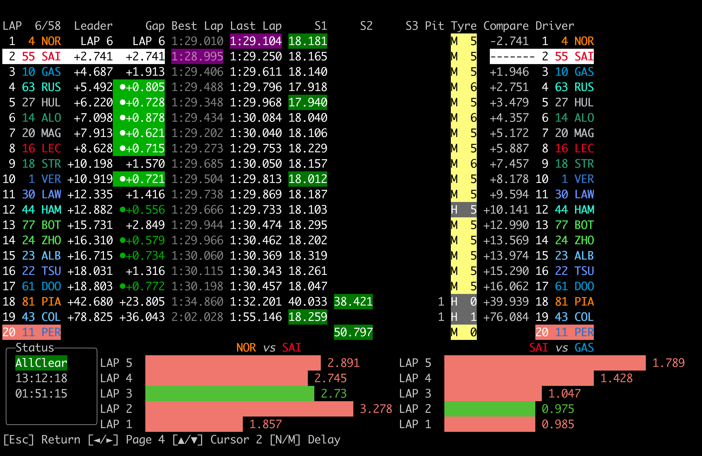
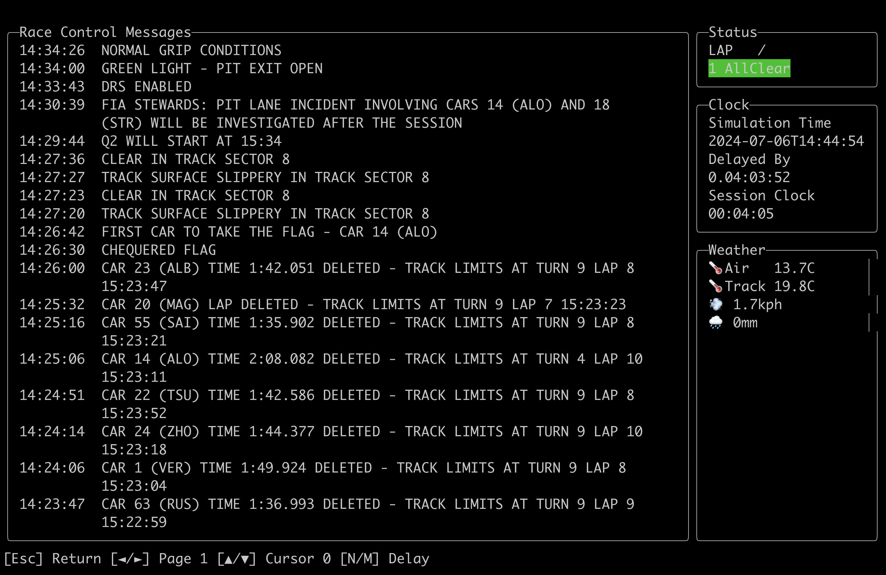

<!-- omit in toc -->
# open-f1

open-f1 is a open source F1 Live Timing client.

`openf1-console` is a TUI application which uses `OpenF1.Data` to show a Live Timing screen during sessions, and records the data for future session replays.

The `OpenF1.Data` library is provided to facilitate connectivity with the F1 Live Timing data stream, and handle all the processing of the incoming data. It also allows for "simulated" streams, where previously recorded data streams can be played back to allow for easy development/testing.

Feature Highlights:


- [Timing Tower](#timing-tower-during-a-race) showing for each driver:
  - Live sector times, with colouring for personal/overall fastest
  - Last & Best Lap
  - Current tyre
  - Age of current tyre
  - Interval to driver in front
  - Gap to leader
  - Gap [between a selected driver](#using-a-cursor-to-display-relative-gap-for-a-specific-driver) and all other drivers (useful for monitoring pit windows)
- [Race Control](#race-control-screen) messages including investigations, penalties, lap deletions, and weather
- Lap-by-lap [Timing History](#using-a-cursor-to-view-timing-history-by-lap) to observe gaps over time

<!-- omit in toc -->
## Table of Contents

- [Inspiration](#inspiration)
- [Getting Started with `openf1-console`](#getting-started-with-openf1-console)
  - [Installation](#installation)
    - [Install and run as a dotnet tool](#install-and-run-as-a-dotnet-tool)
  - [Install and run the standalone executable](#install-and-run-the-standalone-executable)
    - [Run directly from Source](#run-directly-from-source)
  - [Start Timing for a Live Session](#start-timing-for-a-live-session)
  - [Start Timing for a Pre-recorded Session](#start-timing-for-a-pre-recorded-session)
  - [Download a previous session data for replay](#download-a-previous-session-data-for-replay)
  - [During the Session](#during-the-session)
    - [Managing Delay](#managing-delay)
    - [Using the Cursor](#using-the-cursor)
- [Configuration](#configuration)
- [Logging](#logging)
- [Live Timing Data Source](#live-timing-data-source)
- [Data Recording and Replay](#data-recording-and-replay)
- [OpenF1 Console in Action](#openf1-console-in-action)
  - [Timing Tower during a Race](#timing-tower-during-a-race)
  - [Using a Cursor to Display Relative Gap for a Specific Driver](#using-a-cursor-to-display-relative-gap-for-a-specific-driver)
  - [Timing Tower during Practice/Qualifying](#timing-tower-during-practicequalifying)
  - [Race Control Page](#race-control-page)
  - [Using a Cursor to View Timing History by Lap](#using-a-cursor-to-view-timing-history-by-lap)
  - [Listen to and Transcribe Team Radio](#listen-to-and-transcribe-team-radio)
- [Notice](#notice)


## Inspiration

This project is heavily inspired by the [FastF1 project by theOehrly](https://github.com/theOehrly/Fast-F1). They did a lot of the work understanding the SignalR stream coming from the F1 Live Timing service. Visit their project if you'd like to do any sort of data analysis on past F1 events, or gather live timing data using their module.

## Getting Started with `openf1-console`

### Installation

#### Install and run as a dotnet tool

`openf1-console` is available as a `dotnet` tool from NuGet, which means it can be installed system-wide simply by running:

```sh
# Install globally using the -g flag
dotnet tool install -g openf1-console

# Assuming the dotnet tools directory is on your path, simply execute openf1-console
openf1-console
```

This method is recommended as it is easy to keep the app updated using `dotnet tool update -g openf1-console`.

### Install and run the standalone executable

Standalone executables are attached to each GitHub release. Download the executable for your system OS/architecture and simply run it directly

```sh
# Download the latest executable (in this case for macos-arm64)
curl https://github.com/BrownKnight/open-f1/releases/latest/download/openf1-console-macos-arm64 -o ./openf1-console -L

# On MacOS, you'll likely need to sign the executable as otherwise it'll be blocked. 
# WARNING: If you don't understand why this needs to be done, you probably shouldn't do this and instead use the NuGet based installation method above.
#          Signing the executable yourself removes any integrity checks that signing usually provides.
codesign -s - ./openf1-console

# Execute openf1-console to start the TUI
./openf1-console
```

#### Run directly from Source

```sh
# Checkout the git repository
git clone git@github.com:BrownKnight/open-f1.git

# Run the console project with `dotnet run`
dotnet run --project OpenF1.Console/OpenF1.Console.csproj
```

### Start Timing for a Live Session

1. Start `openf1-console` as described above
2. Navigate to the <kbd>S</kbd> `Session` Screen
3. Start a Live Session with the <kbd>L</kbd> `Start Live Session` action.
4. Switch to the Timing Tower screen with the <kbd>T</kbd> `Timing Tower` action

During the session, streamed timing data will be written to `~/open-f1/data/<session-name>`. This will allow for [future replays](#start-timing-for-a-pre-recorded-session) of this recorded data.

### Start Timing for a Pre-recorded Session

Data for pre-recorded sessions should be stored in the `~/open-f1/data/<session-name>` directory. Sample data can be found in this repos [Sample Data](/Sample%20Data/) folder. To use this sample data, copy one of the folders to `~/open-f1/data` and then it will be visible in step 4 below.

1. Start `openf1-console` as described above
2. Navigate to the <kbd>S</kbd> `Session` Screen
3. Start a Simulated Session with the <kbd>F</kbd> `Start Simulation` action.
4. Select the session to start using the Up/Down arrows, then pressing <kbd>Enter</kbd>
5. Switch to the Timing Tower screen with the <kbd>T</kbd> `Timing Tower` action
6. Optionally skip forward in time a bit by decreasing the delay with <kbd>N</kbd> (or <kbd>⇧ Shift</kbd> + <kbd>N</kbd> to decrease by 30 seconds).

### Download a previous session data for replay

F1 provide static timing data files for already completed sessions. This data can be downloaded and converted into the same format `openf1-console` uses to save live recorded data.

1. List the available meetings for the chosen year with `openf1-console import <year> list`
2. Review the list of meetings returned from the command, and view the session inside the chosen meeting with `openf1-console import <year> list --meeting-key <meeting-key>`
3. Review the list of session, and select one to import: `openf1-console import <year> --meeting-key <meeting-key> --session-key <session-key>`

### During the Session

#### Managing Delay

All session data, whether live or pre-recorded, is sent to a `Channel` that acts as a delayed-queue. After a short delay, data points are pulled from the queue and processed, leading to updates on the timing screens. The amount of this delay can be changed with the <kbd>M</kbd>/<kbd>N</kbd> `Delay` actions whilst on the timing screens. Hold <kbd>⇧ Shift</kbd> to change the delay by 30 seconds instead of 5. When using `openf1-console` during a live session, you may wish to increase this delay to around ~50 seconds (actual number may vary) to match with the broadcast delay and avoid being spoiled about upcoming action.

Simulated session start with a calculated delay equal to the amount of time between the start of the actual session and now. This means you can decrease the delay with the <kbd>N</kbd> `Delay` action to fast-forward through the session.

#### Using the Cursor

There is a global cursor that is controlled with the <kbd>▼</kbd>/<kbd>▲</kbd> `Cursor` actions. What this cursor does depends on the screen, for example is can be used in the Timing Tower screen to scroll through Race Control Messages, or to select a driver on the Tower to see comparative intervals.

## Configuration

OpenF1 can be configured using a simple `config.json` file, through the command line at startup, or using environment variables. JSON configuration will be loaded from `~/open-f1/config.json`.

| JSON Path       | Command Line       | Environment Variable   | Description                                                                                                  |
| --------------- | ------------------ | ---------------------- | ------------------------------------------------------------------------------------------------------------ |
| `dataDirectory` | `--data-directory` | `OPENF1_DATADIRECTORY` | The directory in which JSON timing data is read or written from.                                             |
| `verbose`       | `-v\|--verbose`    | `OPENF1_VERBOSE`       | Whether verbose logging should be enabled. Default: `false`. Values: `true` or `false`.                      |
| `apiEnabled`    | `--with-api`       | `OPENF1_APIENABLED`    | Whether the app should expose an API at http://localhost:61937. Default: `false`. Values: `true` or `false`. |

## Logging

`OpenF1.Data` writes logs using the standard `ILogger` implementation. SignalR client logs are also passed to the standard `ILoggerProvider`. 

When running `openf1-console` logs are available in two places:
* Logs are stored in memory and viewable the <kbd>L</kbd> `Logs` screen. Logs can be scrolled on this screen, and the minimum level of logs shown can be changed with the <kbd>M</kbd> `Minimum Log Level` action.
* Log files are written to `~/open-f1/logs`.

Default log level is set to `Information`. More verbose logging can be enabled with the [`verbose` config option](#configuration).

## Live Timing Data Source

F1 live timing is streamed using `SignalR 2`. The `OpenF1.Data` simply connects to this endpoint, subscribes to the data feed, and listens for messages. It subscribes to the following "topics":

* `Heartbeat`
* `ExtrapolatedClock`
* `TopThree`
* `TimingStats`
* `TimingAppData`
* `WeatherData`
* `TrackStatus`
* `DriverList`
* `RaceControlMessages`
* `SessionInfo`
* `SessionData`
* `LapCount`
* `TimingData`
* `CarData.z`
* `Position.z`
* `ChampionshipPrediction`
* `TeamRadio`

## Data Recording and Replay

All events received by the live timing client will be written to the configured `Data Directory`, see [see Configuration for details](#configuration). Files will be written to a subdirectory named using the current sessions name, e.g. `~/open-f1/data/Jeddah_Race/`. In this directory, two files will be written: 

* `subscribe.txt` contains the data received at subscription time (i.e. when the live timing client connected to the stream)
* `live.txt` contains an append-log of every message received in the stream

Both of these files are required for future simulations/replays. The `IJsonTimingClient` supports loading these files and processing them in the same way live data would be. Data points will be replayed in real time, using a calculated delay.

## OpenF1 Console in Action

### Timing Tower during a Race

Monitor sector times and gaps, see recent race control messages, capture position changes, observe pit strategies, and more with the standard Timing Tower view.


### Using a Cursor to Display Relative Gap for a Specific Driver

Use the cursor controlled by the <kbd>▼</kbd>/<kbd>▲</kbd> `Cursor` actions in the <kbd>O</kbd> `Timing Tower` screen to select a specific driver (in this case Norris) to see the relative interval between that driver and all other. This is useful for determining where a driver will fall to after a pit stop, or looking at pit windows during under cuts.

Additionally, the gap between the selected drivers and those around them over the last four laps will be displayed at the bottom of the screen. This allows you to easily see evolving gaps over time and evaluate how soon a driver may catch up or pull away.



### Timing Tower during Practice/Qualifying

Monitor live/best sector times, gaps, tyres, and lap deletions easily with the specialized timing tower for non-race sessions.


### Race Control Page

The `Race Control` page shows all Race Control Messages for the session, along with other session data such as the Weather.



### Using a Cursor to View Timing History by Lap

In the `Timing by Lap` page, you can use the cursor controlled by the <kbd>▼</kbd>/<kbd>▲</kbd> `Cursor` actions to view historical snapshots of the timing tower at the end of every lap. This view will show position changes during that lap, and relative changes in Gap and Interval. Scrolling through laps allows you to build a picture of how the race is unfolding.


### Listen to and Transcribe Team Radio

Listen to team radio clips from anytime in the session, and use a local ML model (Whisper) to transcribe the audio on demand.


## Notice

open-f1 is unofficial and are not associated in any way with the Formula 1 companies. F1, FORMULA ONE, FORMULA 1, FIA FORMULA ONE WORLD CHAMPIONSHIP, GRAND PRIX and related marks are trade marks of Formula One Licensing B.V.
